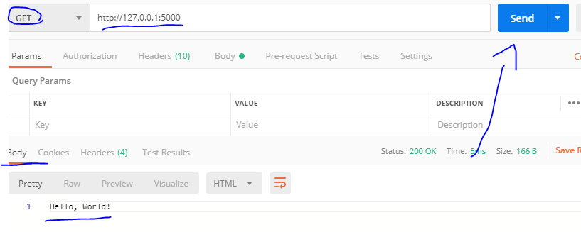
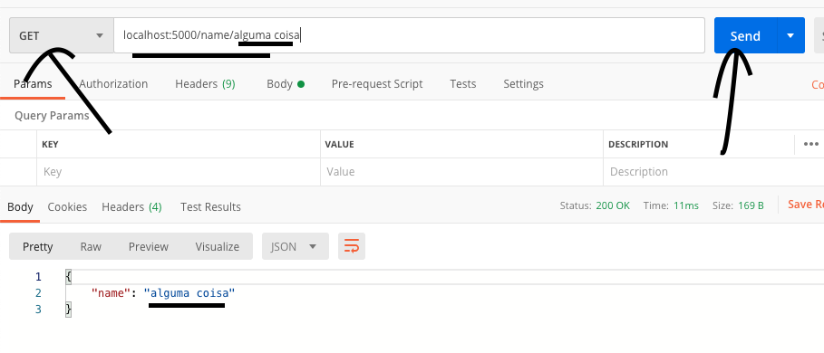

# Inicio

E ai galera vamos la, este e um projeto [Python](https://www.python.org/).
Vamos trabalhar com API.

Para nossa API, iremos utilizar o [Flask](https://flask.palletsprojects.com/en/1.1.x/)

# Instalação

crie um ambente virtual com o python 3.7

````
# crie o ambiente virtual
virtualenv --python=python3.7 .env

#entre no ambiente virtual
source .env/bin/activate

#instale os pacotes necessarios
pip install -r requeriments.txt

#rodar o programa
python app/app.py
````

Instale o programa chamado [Postman](https://www.postman.com/)

Abre o postman e teste a API



Segundo teste da API 


